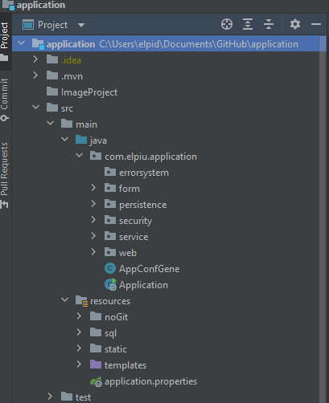
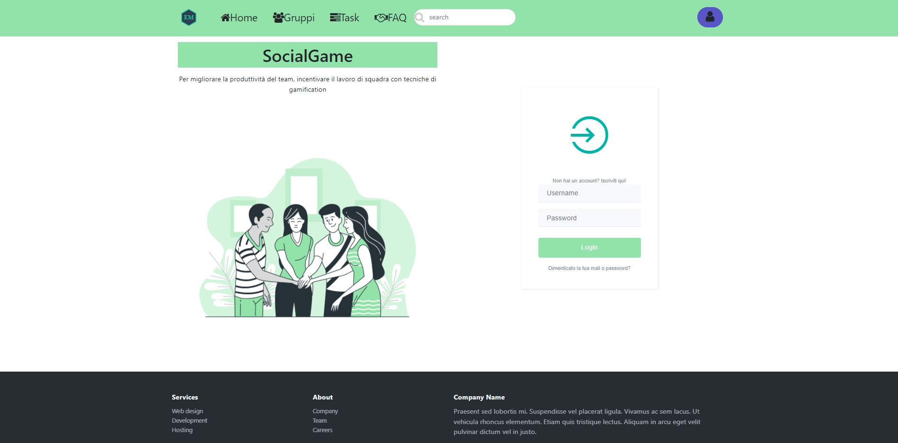
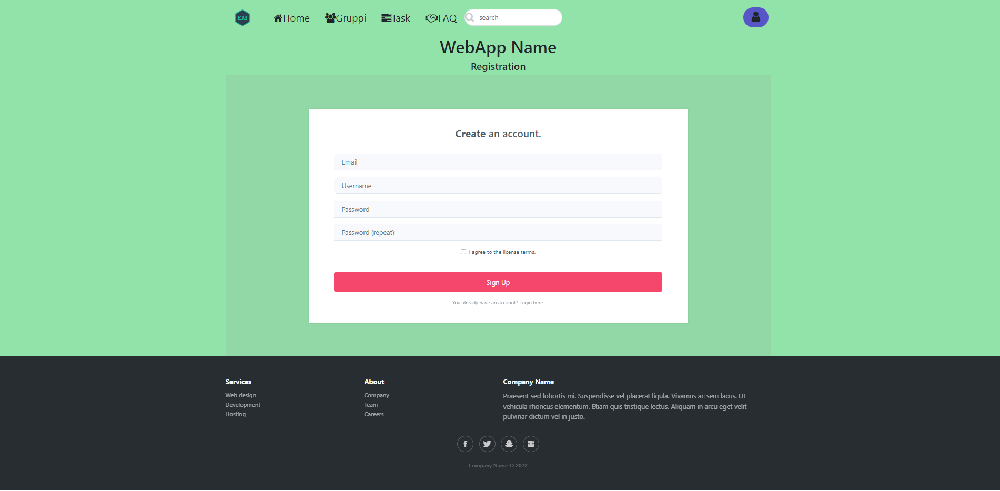
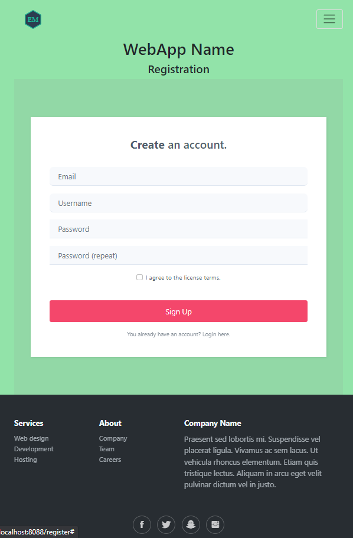
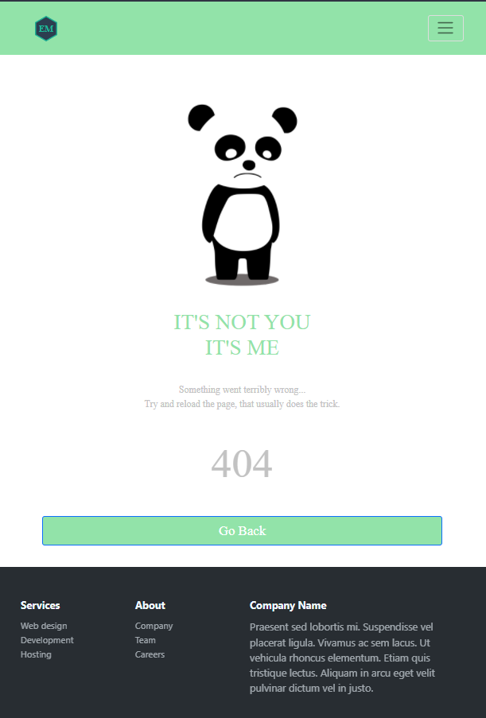

# spring-webApp-starter-template
base per una web application con spring
Questo template è per un webapplication spring-boot, il pacchetto contiene un semplice progetto vuoto configurato e pronto.
Il progetto è stato creato con Intellij, dopo clonato la repository bastera aprirlo con l'ambiente di sviluppo e modificare il file "application.properties" inserendo i vari dati.

Template Engine: Thymeleaf
Spring boot security Login/Logout/Registrazione
Spring validation per i form e patterns
Pagina di erroe e sicurezza dei path

Utilizzo di Entity e Repository

